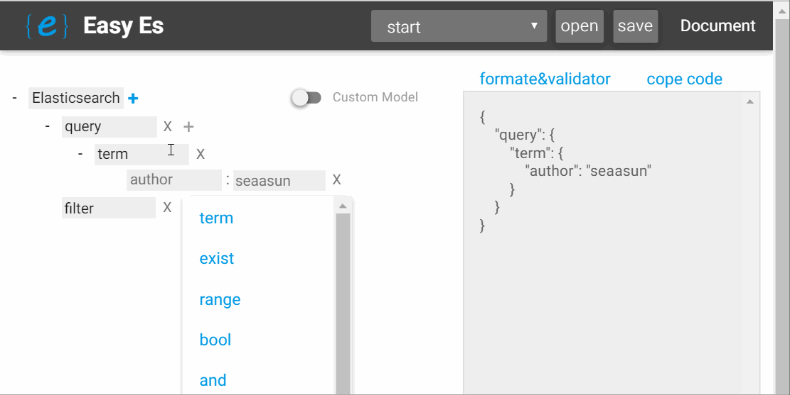

<h1>Easy Es</h1>

  轻点鼠标，自动生成Elastic search 查询语句
  
* 根据指引选项，点击鼠标自动生成查询语句
* 启用custom模式，可随意添加语句
* 可本地保存查询语句
* 可快速自定义指引选项
  
## Quick Start

1. 直接访问使用：[http://whybangbang.github.io/es_query_dsl_mindmanger/](http://whybangbang.github.io/es_query_dsl_mindmanger/ "Title")
2. es 插件安装方法: `bin/plugin install whybangbang/easy-es`

	
## Contribute

欢迎为本项目提供代码！请切换至dev分支

（master分支为es插件所在分支，为精简内容，源代码为提交到master分支内，保存在dev分支）

## To Do List

* 由json反向生成树状图
* 添加wiki
 
## Extend tree
见....

## License
* BSD
