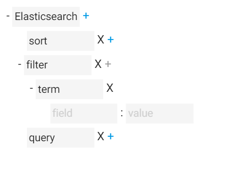
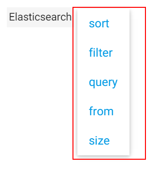
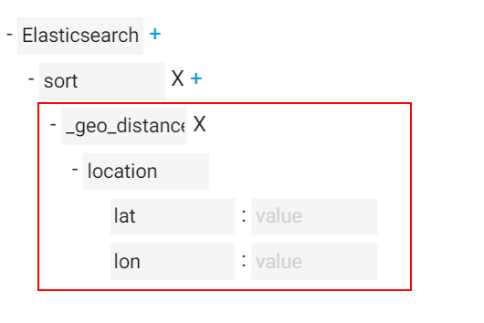
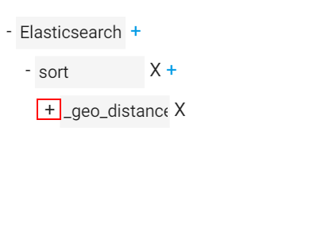
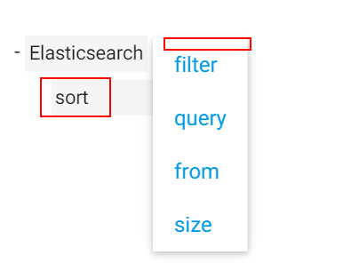

#自定义配置

   ESQ采用可视化的“树”一步步引导你写出json语句，非常酷！不仅如此，只需写些配置文件，你可以很方便的为“树”编写扩展分支。形成树的指引文件叫做parts，在part.js文件内，你只需扩展part.js 就可以写出树的分支。

## 第一，你需知道如何生成选项菜单。


下面的3行代码就可以生成根元素

    ```
    var parts = {
        elastic_search:{
              root:true    //表示为根元素
         }
    }
    ```

之后添加选项,`sort:{}`会自动生成菜单

    ```
    var parts = {
        elastic_search:{
             sort:{},
             filter:{},
             query:{}
             from:{}
             size:{}
        }
    }
    ```

##第二，生成子子菜单
你在树状图上单击‘sort’，想为‘sort’添加选项菜单

为sort定义括展属性

    ```
    var parts = {
        elastic_search:{
             sort:{
                 extend:'sort'
             },
             '''
        }
    }
    ```

再定义sort根

    ```
    var parts = {
        elastic_search:{
             sort:{
                 extend:'sort'
             },
             filter:{},
             '''
        },
        sort:{     //此名称必须和extend:'sort'相等
             '[field]': {},
             _geo_distance: {},
        }
    }
    ```

之后ESQ会自动管理sort扩展，生成sort的子菜单。
请按照js规则写此文件，由于js中变量不能以`[`开头，所以`[field]'`增加`'`号。

为使点击sort后自动弹出菜单，请为sort增加`choose`属性

    ```
    var parts = {
        elastic_search:{
             sort:{
                 choose:true,
                 extend:'sort'
             },
             filter:{},
             '''
    ```

##第三，生成预制模板
很多情况，如下图，你需要预先生成很多子项目，只需增加`child:[]`属性即可。



    ```
    var parts = {
        elastic_search:{
             '''
        },
        sort:{
             '[field]': {},
             _geo_distance: {
                 child: [
                     {field: 'location'   //子项目名称用field
                         child: [     //可以无限添加child
                           { field: 'lat'},
                           { field: 'lat'},
                         ]
                     }，
                  ]
              }
          ]
        }
    }
    ```

你会发现子模板是默认这段的你需要添加`open:true`展开模板



    ```
    _geo_distance: {
       open:true,   //展开模板
       child: [
            {field: 'location'
             open:true,   //请确保每项都增加属性
             child: [
                   { field: 'lat'
                      open: true},
                   { field: 'lat'
                      open: true},
                    ]
               }，
        ]
    }
    ```

你会发现在`location`后面出现删除标记，而`location`是不可删除的，你只需增加`undelete`的字段

    ```
       field: 'location',
       undelete: true,//确保不会删除
       open: true,
       child: [
           {
                field: 'lat',
                undelete: true //每项都要写
            },
    ```

##第四，组绑定，
有时候你希望一个选项只能被添加一次，如下图sort，被添加后不再出现在菜单里



你只需增加 `group:1`，每个菜单项只能被添加一次。

    ```
    var parts = {
        elastic_search:{
             sort:{group:1},
             filter:{group:2},
             query:{group:3}
             from:{group:4}
             size:{group:5}
        }
    }
    ```


如果`gorup`的值相同,则不能同时出现在一个分支中，如果值不同可以出现在同一分支中

    ```
     sort:{group:1},
     filter:{group:1},
    ```

##更多属性

`value: value `  预先填写值

`arrayValue:[value,value]` 会出现下拉菜单

`placeholder`  出现在值的提示词

`array:true`  生成的子选项按数组格式，而不是对象格式

`disabled：true`  禁用字段

`field:field`  会覆盖默认的键值
